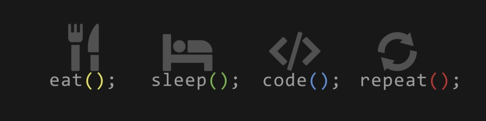

# Hello World!, I'm Galang, i'mam Fullstack javascript from indonesia 👋🏼:

🛜 currently working on my own [webpage](https://tobiasmeyhoefer.com) 👨🏼‍💻 working as a fullstack developer since 2025 in [office](https://designcornerjkt.com)

## 🌐 Socials:

  

# 💻 Tech Stack:

                     

# 📊 GitHub Stats:

 
 

## 🏆 GitHub Trophies

---

<!-- Proudly created with GPRM ( https://gprm.itsvg.in ) -->

<picture>
  <source media="(prefers-color-scheme: dark)" srcset="https://raw.githubusercontent.com/Regalangcom/Regalangcom/output/github-snake-dark.svg" />
  <source media="(prefers-color-scheme: light)" srcset="https://raw.githubusercontent.com/Regalangcom/Regalangcom/output/github-snake.svg" />
  
</picture>
